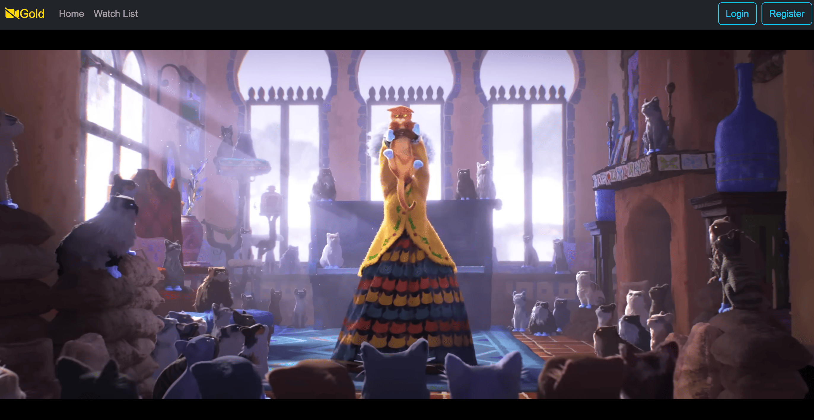

# Movie Review App

This is a full-stack web application that allows users to browse movies, watch trailers, and add reviews. The app uses the IMDB API to fetch movie details and provides users with an interface to interact with these movies, including watching trailers and writing reviews.

## Table of Contents

- [Features](#features)
- [Technologies Used](#technologies-used)
- [Setup Instructions](#setup-instructions)
- [Frontend](#frontend)
- [Backend](#backend)
- [Running the Application](#running-the-application)
- [API Endpoints](#api-endpoints)
- [Future Improvements](#future-improvements)

## Features

- **Browse Movies**: Users can scroll through a list of movies fetched from the IMDB API.


- **Watch Trailers**: Integrated with React Player to watch movie trailers.



- **Add Reviews**: Users can write and submit reviews for movies.


- **Responsive Design**: The UI is built using Bootstrap to ensure responsiveness across different devices.

## Technologies Used

### Frontend

- **React**: For building the user interface.
- **React Router**: For handling routing in the app.
- **React Player**: For embedding and playing movie trailers.
- **Bootstrap**: For responsive design and styling.
- **Axios**: For making API requests to the backend.

### Backend

- **Java Spring Boot**: As the backend framework to build RESTful APIs.
- **Spring Data JPA**: For database interaction.
- **Mongo Database**: An in-memory database for development and testing purposes.
- **IMDB API**: Used to fetch movie data.

## Setup Instructions

To run this project locally, you will need to have Node.js, npm, Java, and Maven installed on your machine.

### Frontend

1. **Navigate to the frontend directory**:

   ```bash
   cd frontend
   ```

2. **Install dependencies**:

   ```bash
   npm install
   ```

3. **Start the React development server**:

   ```bash
   npm start
   ```

   This will run the frontend on `http://localhost:3000`.

### Backend

1. **Navigate to the backend directory**:

   ```bash
   cd backend
   ```

2. **Build the project using Maven**:

   ```bash
   mvn clean install
   ```

3. **Run the Spring Boot application**:

   ```bash
   mvn spring-boot:run
   ```

   The backend will be running on `http://localhost:8080`.

## Running the Application

1. Make sure both the frontend and backend servers are running.
2. Open a web browser and navigate to `http://localhost:3000`.
3. You can now browse movies, watch trailers, and add reviews.

## API Endpoints

The backend server provides the following API endpoints:

- **GET /api/v1/movies**: Fetches a list of movies from the IMDB API.
- **POST /api/v1/reviews**: Adds a new review for a specific movie.
- **GET /api/v1/reviews/{movieId}**: Fetches reviews for a specific movie.

## Future Improvements

- **User Authentication**: Add user authentication and authorization for managing reviews.
- **Database Integration**: Move from H2 to a more scalable database solution (e.g., MySQL, PostgreSQL).
- **Search and Filter**: Implement search and filter functionality to make browsing easier.
- **Rating System**: Allow users to rate movies in addition to writing reviews.

## License

This project is open-source and available under the MIT License.
